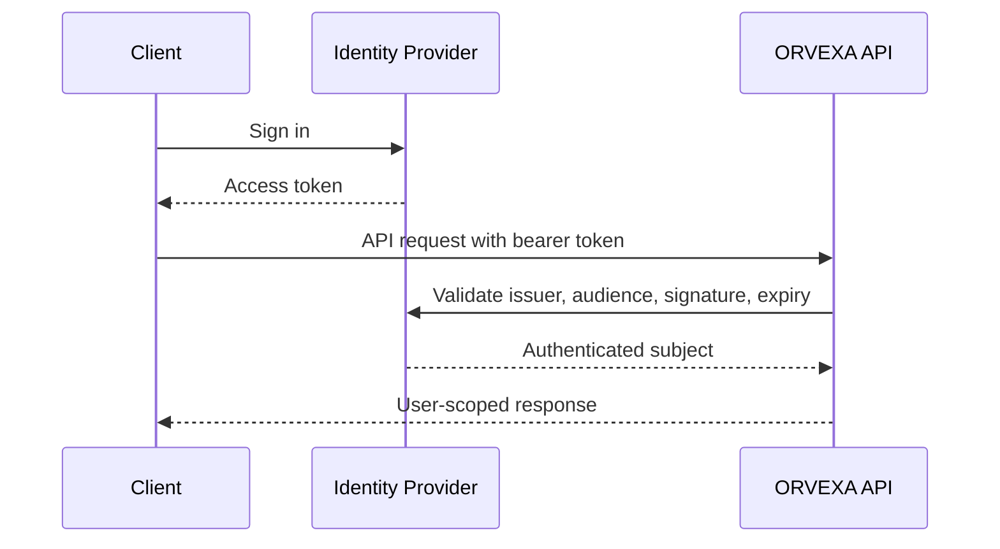

# Authentication Flow

Authentication is planned for Phase 2 and is not implemented in the Phase 1 foundation.

```mermaid
sequenceDiagram
  participant C as Client
  participant I as Identity Provider
  participant A as ORVEXA API
  C->>I: Sign in
  I-->>C: Access token
  C->>A: API request with bearer token
  A->>I: Validate issuer, audience, signature, expiry
  I-->>A: Authenticated subject
  A-->>C: User-scoped response
```
